# 1부 — AWS 계정 가입

> 더 알아보기: [서버리스 데이터 파이프라인](../../../wiki/serverless-data-pipeline.md) · [AWS IAM](../../../wiki/aws-iam.md)

소요: 가입 15~20분 + 가입 직후 설정 약 25분 (활성화 대기 최대 24시간 별도)

이 계정은 **조직(또는 본인) 명의**입니다. 데이터·비용·이후 운영이 모두 계정 소유자 것이 되도록, 배포 작업자(사람이든 에이전트든)가 대신 만들지 않고 계정 소유자가 직접 만듭니다.
아래 순서대로 진행하고, 막히면 § 5 「자주 막히는 곳」을 봅니다. 가입이 끝나면 [2부 「배포 키 발급」](02-restricted-key.md)으로 이어집니다.

결정값 요약: 계정 명의 = 조직(또는 본인) · 플랜 = **유료(Paid)** · 지원 플랜 = **기본 지원 - 무료** · 리전 = 서울 · 루트 이메일 = 회사 공용 메일 · 결제 = 법인 신용카드 · 세금 설정 = 사업자등록번호 + 사업자등록증.

> **민감값 주의** — 카드 번호, 루트 암호, 비밀 액세스 키를 입력하거나 화면에 띄우는 동안은 화면 공유·녹화를 잠시 멈추고, 에이전트(Claude 등) 대화창에도 붙여 넣지 않습니다.

## 1. 준비물 (가입 전 체크리스트)

가입 시작 전에 아래를 손에 들고 시작하면 15~20분에 끝납니다. 하나라도 없으면 중간에 멈춥니다.

- [ ] **회사 공용 이메일 주소** — 새로 만들어도 됩니다(예: `aws@회사도메인`). 이 주소가 AWS 계정의 "루트 사용자" 로그인 ID 가 됩니다. 이미 다른 AWS 계정에 쓴 이메일은 쓸 수 없습니다.
- [ ] **그 메일함을 지금 열어 둘 것** — 가입 중 인증 코드가 옵니다.
- [ ] **법인 신용카드** (카드번호·유효기간·CVC). 해외 결제 가능한 Visa / MasterCard / AmEx. 체크카드는 실패할 수 있습니다. 가입 화면 문구: "1 USD(또는 그에 상당하는 금액)를 3~5일간 예치하여 계정을 인증" — 인증용 예치이며 며칠 뒤 풀립니다.
- [ ] **회사 주소(한글)** — 국가를 대한민국으로 고르면 한글로 입력합니다. 영문 주소는 필요 없습니다. 청구서 주소로 쓰입니다.
- [ ] **담당자 휴대폰 번호** — 연락처에 +82 형식으로 입력합니다.
- [ ] **사업자등록번호 + 사업자등록증 파일**(PDF 또는 이미지, 5 MB 이하) — 가입 후 세금 설정에서 입력·업로드합니다. 세금계산서를 받으려면 필수입니다. 사업자가 아닌 본인 명의 계정이면 이 항목과 3.2 는 건너뜁니다.
- [ ] **스마트폰에 인증 앱** — Google Authenticator 또는 Microsoft Authenticator. 가입 후 MFA 등록에 씁니다.

## 2. 가입 절차 (콘솔 화면 순서)

주소: <https://portal.aws.amazon.com/billing/signup> (또는 <https://signin.aws.amazon.com> → "새 AWS 계정 생성"). 화면 언어는 오른쪽 위에서 한국어로 바꿀 수 있습니다.
아래 화면은 2026년 9월 실제 가입 화면입니다(계정 식별값은 회색 칸으로 가렸습니다). AWS 가 화면을 바꾸면 문구가 조금 다를 수 있습니다 — 그때는 화면을 기준으로 진행합니다.

### 2.1 가입 — 이메일·계정 이름

루트 사용자 이메일(회사 공용 메일)과 AWS 계정 이름을 넣습니다. 계정 이름은 청구서·콘솔에 표시됩니다. 권장 형식 `회사영문명-aws-2026`.

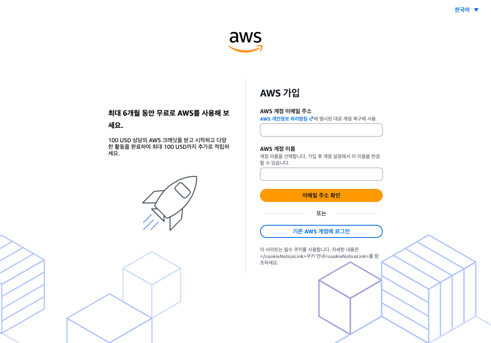

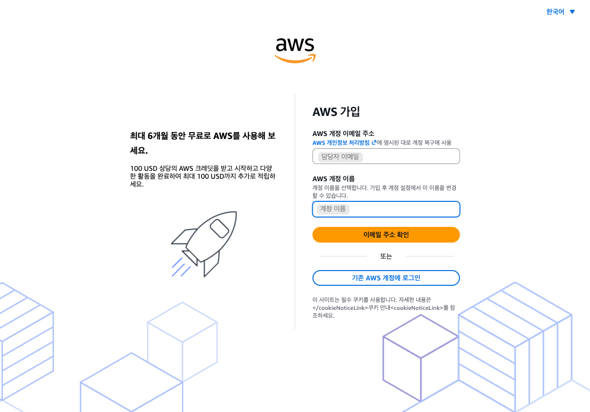

### 2.2 이메일 인증 코드

메일로 온 인증 코드를 입력합니다. 유효 시간이 짧으니 메일함을 열어 두세요.

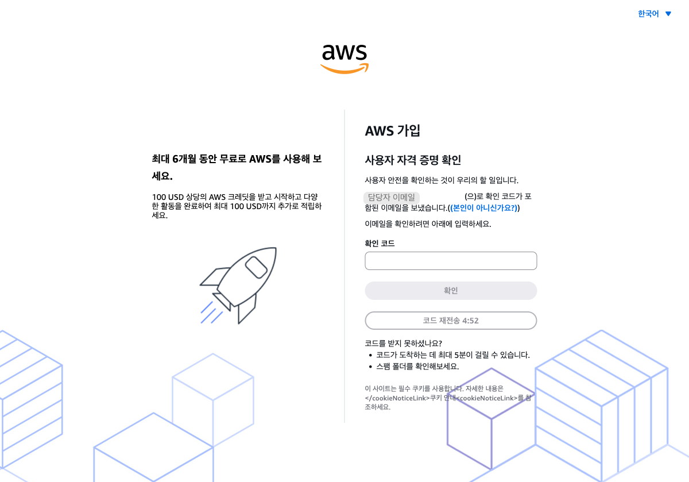

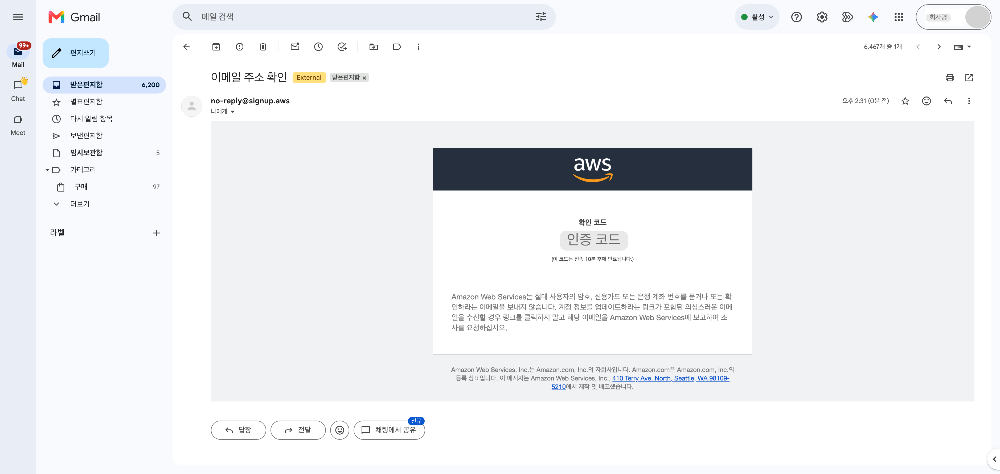

### 2.3 루트 암호 만들기 (1/5단계)

8자 이상, 대문자·소문자·숫자·기호 중 3종 이상. **흔한 암호는 "제3자로부터 유출된 데이터 세트를 통해 공개적으로 알려졌습니다"라는 문구로 거부**됩니다. 비밀번호 관리자에 저장하세요.

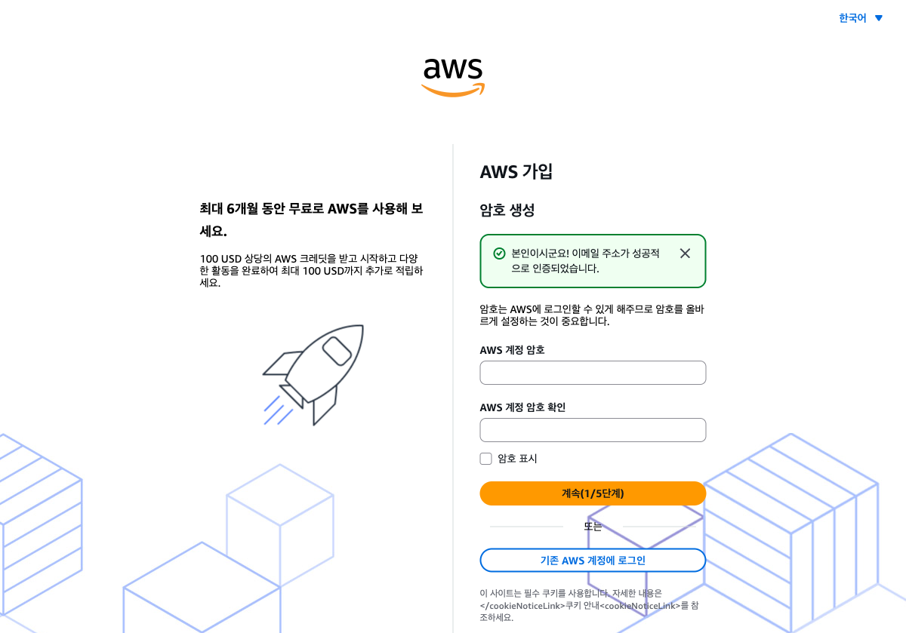

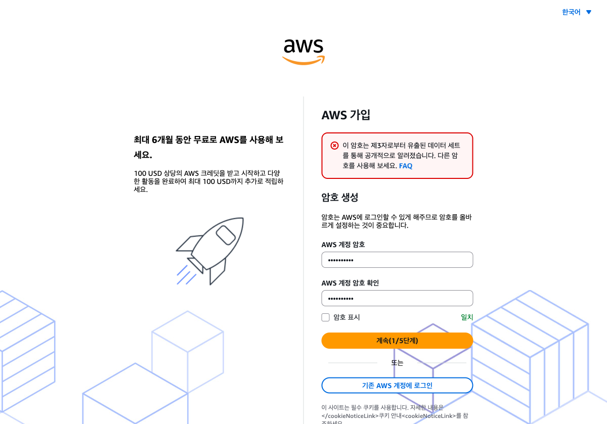

### 2.4 플랜 선택

오른쪽 **유료 플랜 선택** 버튼을 누릅니다(왼쪽 "무료(6개월)"가 아닙니다). 무료 플랜은 6개월 뒤 종료되고 일부 서비스가 제한됩니다.

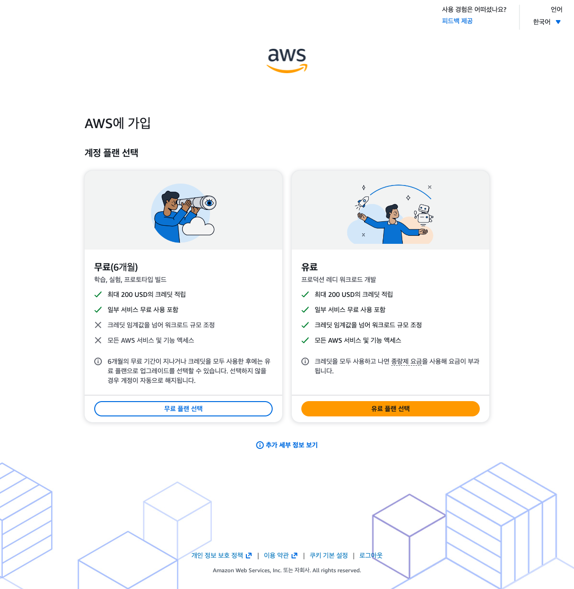

### 2.5 연락처 정보 (2/5단계)

전체 이름, **조직 이름**(선택이지만 회사명 입력), 국가 코드 **+82** + 전화번호, 국가 = **대한민국**, 주소, 시, 시/도, 우편번호를 넣고 약관 동의에 체크합니다.
국가 코드는 기본이 +1 입니다 — 반드시 +82 로 바꿉니다. 국가를 대한민국으로 바꾸면 주소 칸이 한글 입력으로 바뀝니다.

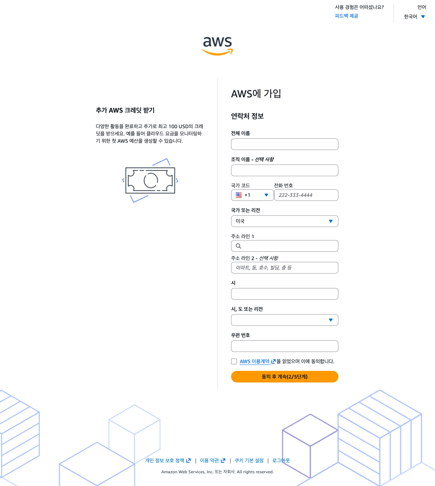

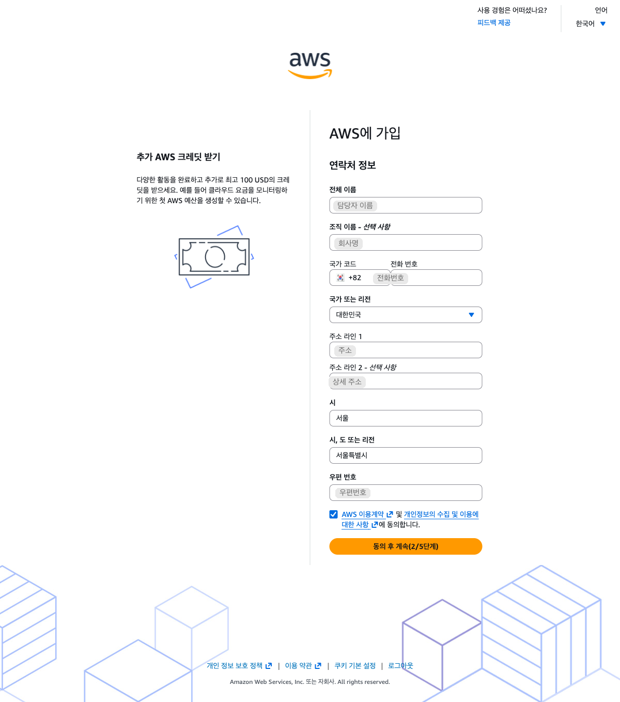

### 2.6 결제 정보 (3/5단계)

카드 번호·만료(MM/YY)·보안 코드·카드 이름을 넣습니다. 청구지 주소는 앞 단계 주소가 자동으로 들어갑니다. **결제 연락처 이메일** 칸이 있으면 경리 담당 메일을 넣습니다.
「확인」을 누르면 **카드사 인증 창이 새 창(또는 새 탭)으로 열립니다.** "카드 발급자에 연결 중"에서 멈춘 것처럼 보이면 다른 창·탭을 확인하고, 팝업이 막혔으면 브라우저에서 허용한 뒤 카드사 앱에서 승인합니다.

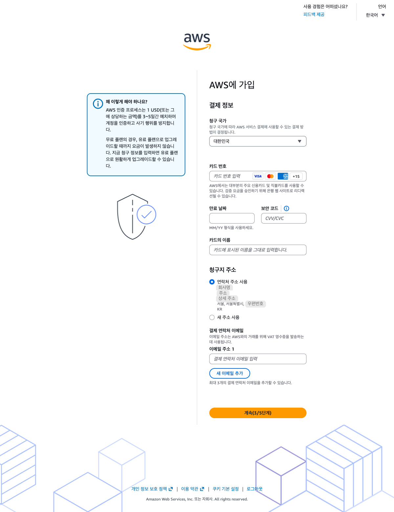

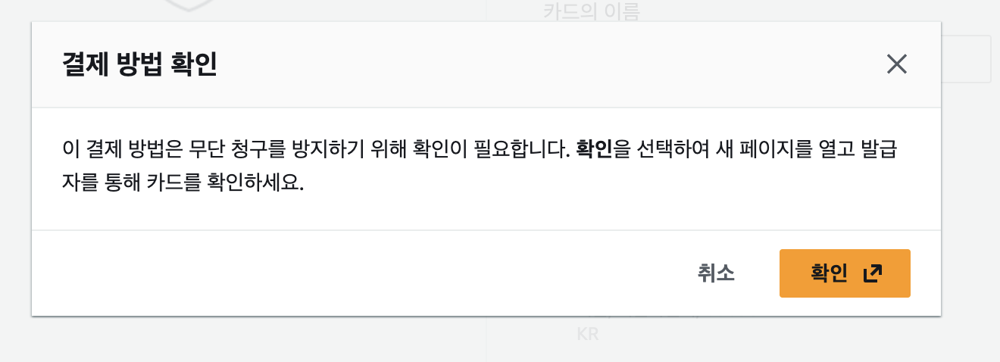

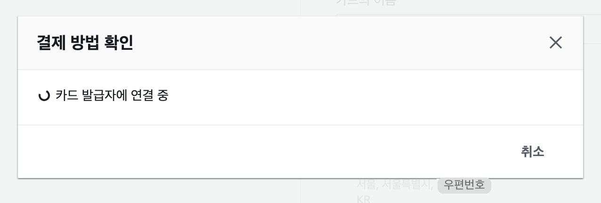

### 2.7 지원 플랜 (5/5단계)

**기본 지원 - 무료**를 고릅니다. "비즈니스 지원+"(월 USD 29부터)는 필요 없습니다. 2026년 9월 화면에서는 4/5단계(문자 PIN 본인 확인)가 나오지 않았습니다 — 카드 인증이 대신합니다. 나타나면 문자 또는 음성 PIN 을 입력합니다.

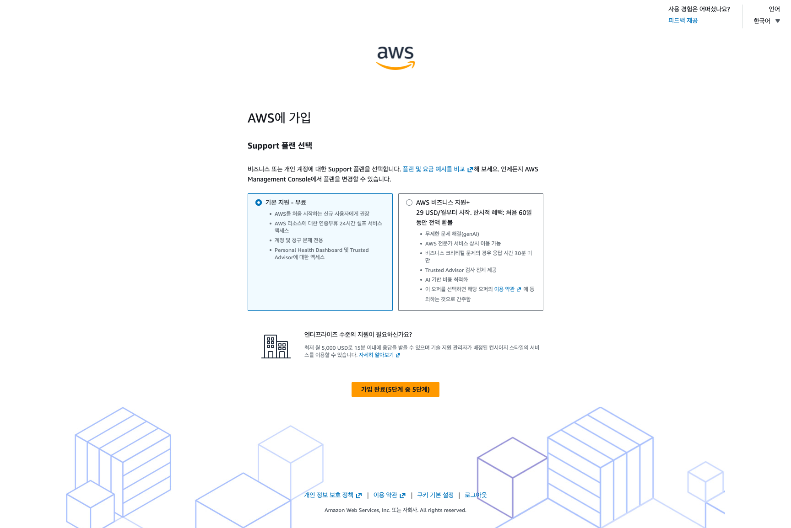

### 2.8 완료 → 활성화 대기

"가입 완료" 화면이 나오면 활성화를 기다립니다. 보통 수 분, **최대 24시간**. 활성화 메일이 오면 콘솔에 로그인할 수 있습니다. 처음 로그인하면 안내 팝업이 뜹니다 — 「다음」으로 넘기거나 닫습니다.

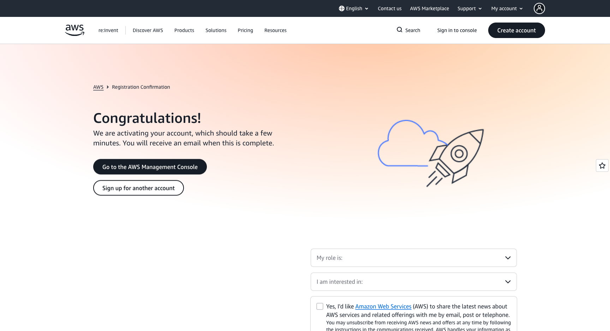

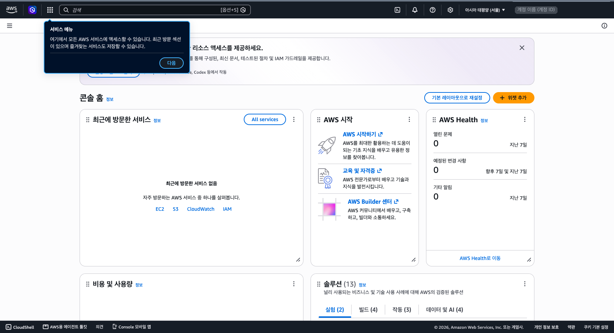

활성화 메일이 24시간 안에 안 오면 카드 확인 실패가 대부분입니다. 콘솔 → 과금 정보 및 비용 관리 → 왼쪽 **결제 기본 설정**에서 카드 상태가 "확인 필요"면 「확인」으로 재인증하고, 그래도 실패하면 카드를 삭제하고 다른 카드를 등록합니다.

## 3. 가입 직후 반드시 할 7가지 (순서대로, 약 25분)

3.1~3.4 는 **루트 사용자**로, 3.5 에서 관리자 사용자를 만든 뒤 3.5 후반~3.7 과 2부 전체는 **그 관리자 사용자**로 합니다.
이 일곱 개를 끝내기 전에는 아무 서비스도 만들지 않습니다.

### 3.1 루트 사용자 MFA 등록 (5분)

1. 오른쪽 위 계정 이름 → **보안 자격 증명**.
2. **MFA 할당** → 디바이스 이름 `root-phone-<영문이름>`(한글 불가 — 영문·숫자·`+=,.@_-`만) → 화면 기본 선택이 "패스키 또는 보안 키"이므로 **인증 관리자 앱**으로 바꿔 선택 → 다음.
3. 스마트폰 인증 앱으로 QR 을 스캔 → 앱에 뜨는 6자리 코드를 두 번 연속 입력 → 완료.
4. 권장: 두 번째 MFA 디바이스(다른 사람 폰 또는 하드웨어 키)도 등록 — 폰을 잃어도 계정이 잠기지 않습니다. 최대 8개까지 등록됩니다.
5. 같은 화면 **액세스 키** 항목이 "액세스 키 없음"인지 확인합니다. 루트 액세스 키는 절대 만들지 않습니다.

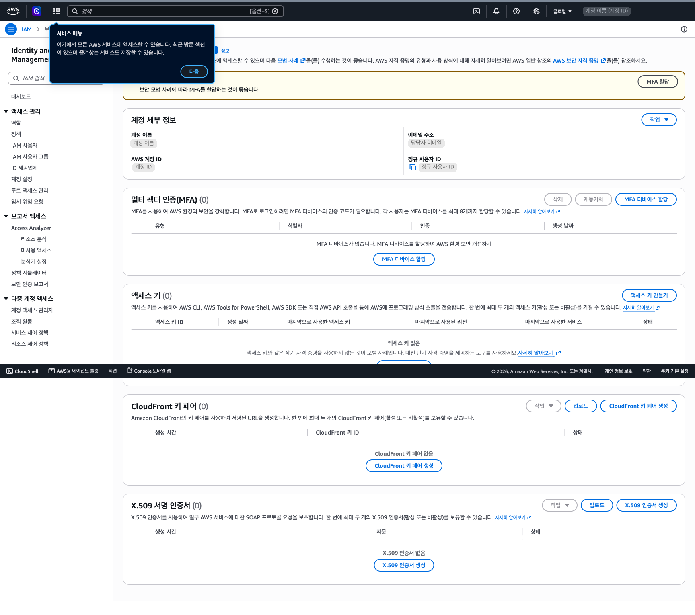

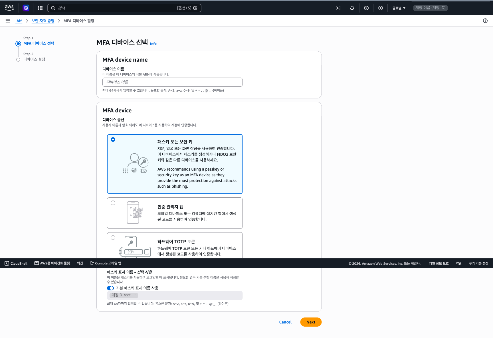

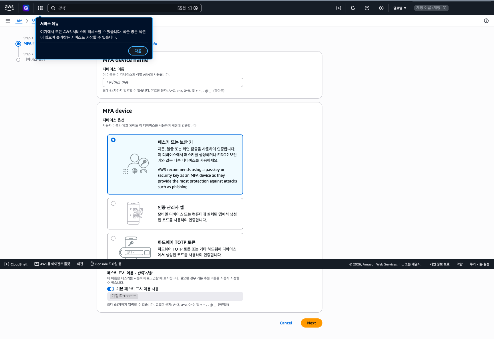

왜: 루트는 결제·계정 폐쇄까지 되는 최상위 권한입니다. 비밀번호만으로 뚫리면 계정 전체를 잃습니다.

### 3.2 세금 설정 — 사업자등록번호 등록 (5분)

1. 오른쪽 위 계정 이름 → **과금 정보 및 비용 관리** → 왼쪽 **세금 설정**.
2. **세금 등록 관리** → 계정 선택 → **편집** → 국가/지역 **대한민국**.
3. **VAT 이메일 주소**: 세금계산서를 받을 경리 메일.
4. **세금 등록 번호(TRN)**: 사업자등록번호 `123-45-67890` 형식(앞에 KR 을 붙이지 않습니다).
5. **세금 등록 증명서**: 「파일 선택」으로 사업자등록증 파일을 올립니다(최대 5개, 파일당 5 MB).
6. **기업 법인명·대표자·업태·종목**: 사업자등록증과 **글자까지 동일하게**.
7. **기업 법인 주소**: 사업자등록증 주소 → 다음 → 주소 확인 → 저장.
8. 처리에 며칠 걸릴 수 있습니다. 상태가 "확인됨"이 되면 이후 청구분부터 **AWS Korea 명의 세금계산서**가 발행됩니다.

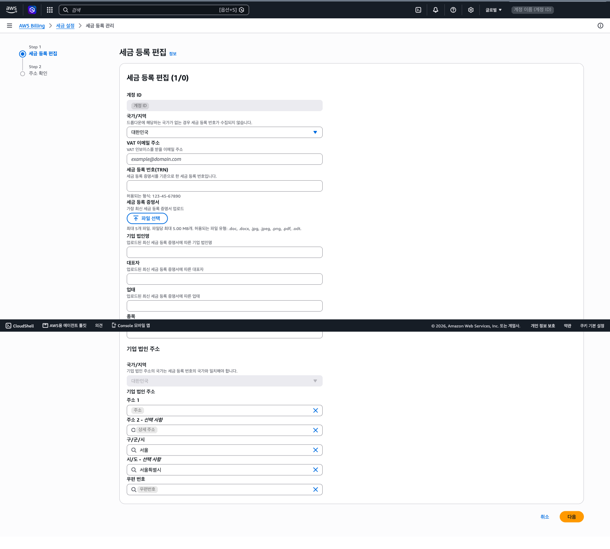

왜: 등록하지 않으면 세금계산서가 나오지 않고 부가세 매입세액공제를 받지 못합니다.

### 3.3 결제 설정·비용 조회 열기 (2분)

1. 과금 정보 및 비용 관리 → 왼쪽 **결제 기본 설정** → 기본 결제 수단이 등록한 법인카드인지 확인합니다. 결제 통화는 **USD 유지**를 권장합니다.
2. 왼쪽 **빌링 기본 설정** → "PDF 인보이스 이메일로 받기" 체크 → 경리 메일 추가.
3. 오른쪽 위 계정 이름 → **계정** → 아래로 내려 **결제 정보에 대한 IAM 사용자 및 역할 액세스** → **편집** → 활성화 → 업데이트.
   이것이 꺼져 있으면 3.5 에서 만들 관리자 사용자도 결제·청구 화면을 보지 못합니다.
4. 과금 정보 및 비용 관리 → 왼쪽 **Cost Explorer** 를 한 번 엽니다. 처음 열 때 켜지고, 데이터는 최대 24시간 뒤부터 보입니다(처음 열면 "빌링 보기 변경이 지원되지 않음" 같은 안내가 뜰 수 있습니다 — 닫으면 됩니다). 열어 두지 않으면 배포 키로 하는 비용 조회가 실패합니다.

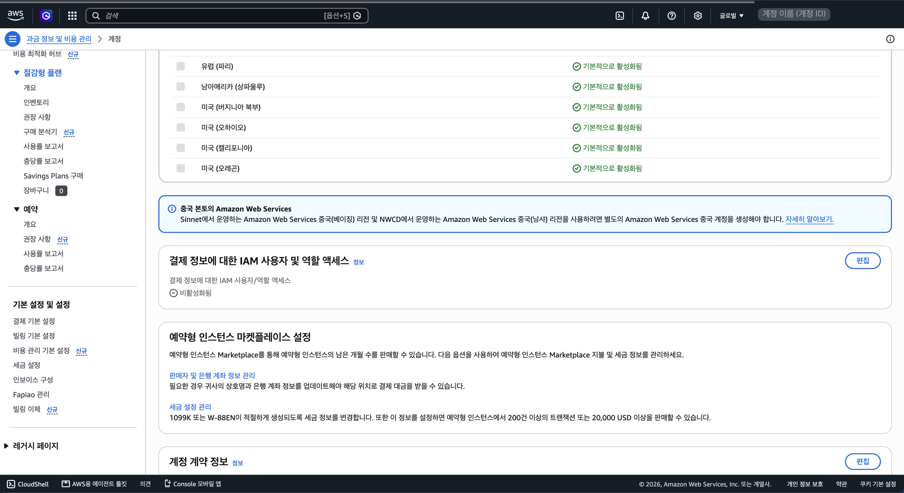

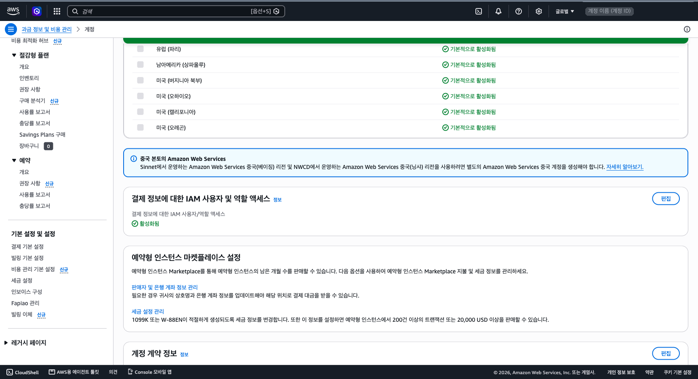

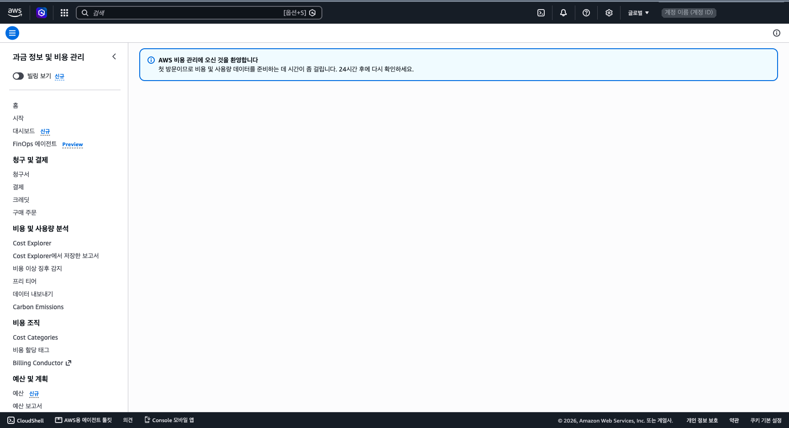

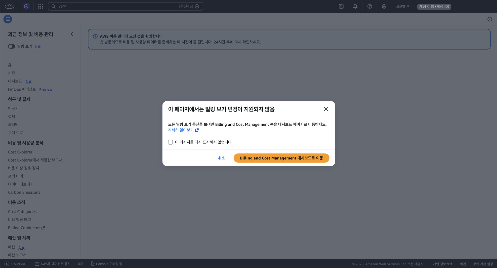

### 3.4 예산 알림 — 비용 사고 방지 (5분)

1. 과금 정보 및 비용 관리 → 왼쪽 **예산** → **예산 생성**.
2. **사용자 지정** → 유형 **비용 예산** → 이름 `sls-monthly` → 기간 월별 → 예산 금액 **USD 50**(§ 4 를 보고 사용 규모에 맞게 정합니다).
3. 알림 임계값 3개: 실제 50 % / 실제 80 % / **예측 100 %**. 수신 이메일에 **계정 관리자 메일**(배포 작업자도 받고 싶으면 그 주소도, 쉼표로 구분).
4. 예산 하나 더: 이름 `sls-zero-guard`, 금액 USD 1, 실제 100 % 알림 — "무언가 과금되기 시작했다"를 바로 알려 줍니다.
   이 알림은 **첫 달에 곧 울립니다** — 배포 키로 하는 비용 조회(1회 USD 0.01)와 검색 엔진(§ 4)이 과금되기 때문이며, 예상된 알림입니다.

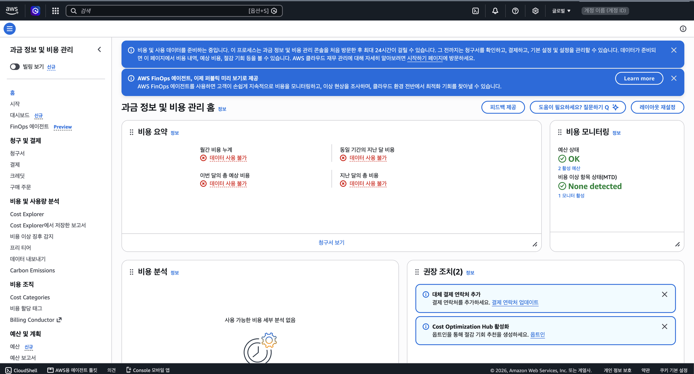

왜: 실수로 켜진 리소스는 알림이 없으면 월말에 압니다. 예산은 알림만 하고 멈추지는 않으므로, 3.6 의 용량 상한과 같이 씁니다.

### 3.5 계정 관리자용 관리자 사용자 만들기 — 이후 루트는 쓰지 않습니다 (5분)

1. 상단 검색창 **IAM** → **사용자** → **사용자 생성** → 이름 `admin-<영문이름>`(예: `admin-hong`. 한글은 쓸 수 없습니다).
2. **AWS Management Console에 대한 사용자 액세스 권한 제공** 체크 → "IAM 사용자를 생성하고 싶음" → 콘솔 암호 자동 생성 → 다음 로그인 시 변경 체크.
3. 권한: **직접 정책 연결** → `AdministratorAccess` 체크 → 생성. (계정 관리자 본인용이라 관리자 권한입니다. 배포 키 사용자 `sls-deployer` 는 2부의 제한 정책을 씁니다.)
4. 생성 완료 화면의 **콘솔 로그인 URL**(`https://<12자리 계정 ID>.signin.aws.amazon.com/console`)과 임시 암호를 비밀번호 관리자에 저장합니다. 이 URL 의 12자리 숫자가 **계정 ID** 입니다.
5. 루트에서 로그아웃하고 그 URL 로 새 사용자로 로그인 → 암호 변경 → **보안 자격 증명 → MFA 할당**(3.1 과 같은 방법).
6. 이 사용자의 **ARN** 을 적어 둡니다(배포 작업자가 따로 있으면 알려 줍니다) — IAM → 사용자 → `admin-…` → 요약의 `arn:aws:iam::…:user/admin-…` 한 줄입니다. 배포 때 이 값을 넣어야 계정 관리자가 이 사용자로 검색 엔진 대시보드를 볼 수 있습니다.

이후 루트는 결제 수단 변경·지원 플랜 변경·계정 폐쇄 때만 씁니다.

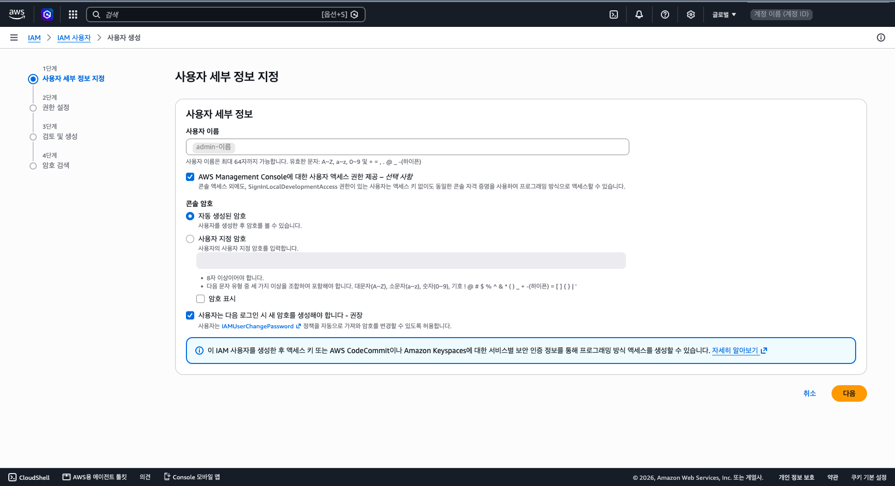

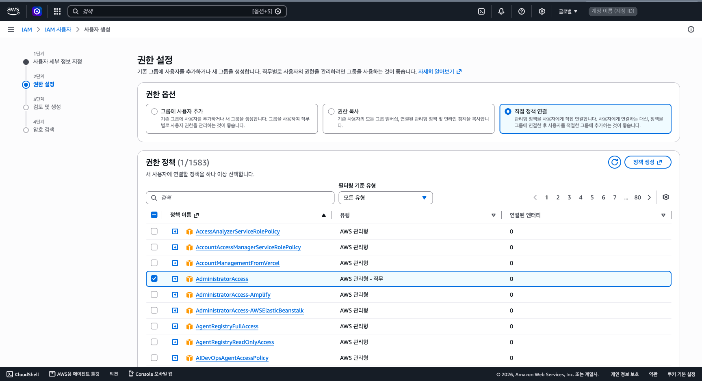

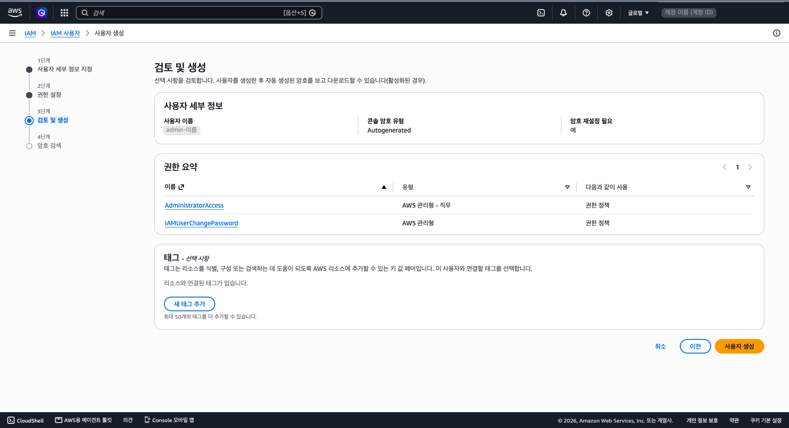

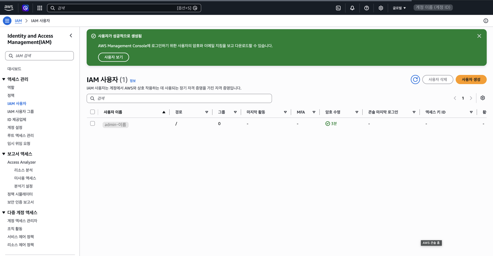

### 3.6 검색 엔진(OpenSearch) 용량 상한 낮추기 (2분)

검색 엔진(OpenSearch Serverless)은 부하가 오르면 자동으로 용량(OCU)을 늘리고 요금도 따라 오릅니다. 상한을 최소로 걸어 둡니다.

1. 오른쪽 위 리전이 **아시아 태평양(서울)** 인지 먼저 확인합니다 — 이 상한은 리전마다 따로입니다.
2. 검색창 **Amazon OpenSearch Service** → 왼쪽 **Serverless** → **대시보드** → 아래쪽 **용량 관리** → **구성**.
3. **최대 인덱싱 용량**·**최대 검색 용량**을 각각 **2**(고를 수 있는 최솟값, 기본값은 10)로 → **확인**.

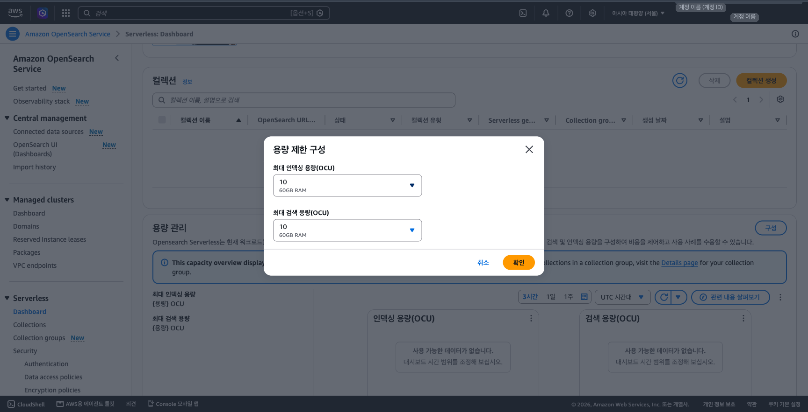

왜: 배포 키로는 이 설정을 바꿀 수 없게 막혀 있습니다. 이 상한을 비켜 가는 별도 용량 묶음(컬렉션 그룹)을 만들거나 바꾸는 것도 막혀 있습니다. 계정 관리자만 바꿀 수 있어야 비용 상한이 지켜집니다. 이 "상한 2"는 부하가 몰릴 때의 최대치이고, 평소 요금은 § 4 의 최소 구성 기준입니다.

### 3.7 S3 계정 수준 퍼블릭 액세스 차단 켜기 (1분)

1. 검색창 **S3** → 왼쪽 **계정 및 조직 설정** → "이 계정의 퍼블릭 액세스 차단 설정" → **편집**.
2. **모든 퍼블릭 액세스 차단** 체크(하위 4개가 모두 켜짐) → 변경 사항 저장 → 확인 문구 입력.

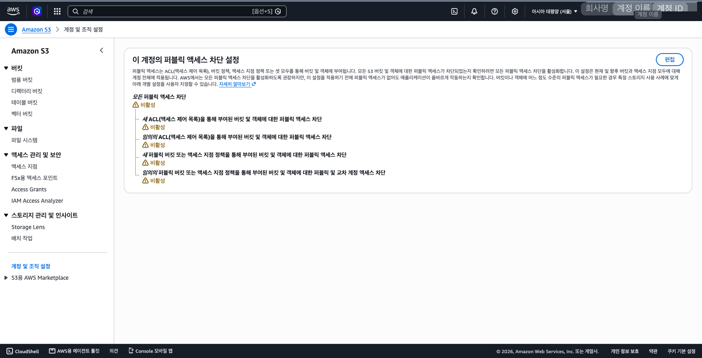

왜: 새 계정은 이 설정이 비어 있습니다. 켜 두면 어떤 사용자·키로도 파일 보관소를 인터넷에 공개할 수 없고, 배포 키는 이 설정을 끌 수 없게 막혀 있습니다.

## 4. 이 계정에 무엇이 만들어지나 (한 장 설명)

배포 키로 이 계정 안에 아래 다섯 가지를 만듭니다. 검색 엔진(OpenSearch)을 뺀 나머지는 **쓴 만큼만 과금**되어 시범 사용 규모에서는 월 수천 원 안쪽입니다.
**OpenSearch Serverless 는 켜 둔 시간만큼 고정 요금**이 나옵니다 — 쓰는 날에만 만들고 그날 지우는 것을 기본으로 합니다.

| 서비스 | 하는 일 | 비유 | 월 비용 감(시범 사용 규모) |
|---|---|---|---|
| **S3** | 파일 보관소. NAS·PC 에 흩어진 파일을 여기 올립니다 | 무제한 외장하드 + 버전 기록 | 저장한 용량만큼, 시범 사용 규모면 수백 원 (예상치) |
| **Lambda** | 파일이 올라오면 자동으로 실행되는 작은 프로그램 | 일 있을 때만 출근하는 자동 분류 담당 | 무료 구간 안 (예상치) |
| **DynamoDB** | 정리된 데이터를 저장하는 표. 서버 관리 없음 | 수억 행도 되는 엑셀 시트 | 수백~수천 원 (예상치) |
| **OpenSearch Serverless** | 검색·집계 엔진. "지난달 불량 건" 같은 질문에 답합니다 | 사내 검색창 | **고정비** — 켜 두면 월 약 USD 214~428(하루 약 USD 7~14). 부하가 몰려도 3.6 의 상한 덕에 월 약 USD 855 를 넘지 않습니다. 첫 달 청구서로 확정합니다 |
| **CloudWatch · Budgets** | 로그·알림·예산 | 계기판과 경보등 | 무료 구간 안 (예상치) |

전체 흐름: 파일 업로드(S3) → 자동 처리(Lambda) → 저장(DynamoDB) → 변경 감지 → 검색 색인(OpenSearch) → 질문·집계.
3.4 의 예산 금액은 이 고정비를 넣고 정합니다 — 검색 엔진을 켜 둔 달은 USD 50 예산 알림이 첫 주에 울립니다. 사용 일정이 정해지면 그에 맞춰 예산 금액을 다시 정합니다.
배포 키로 막지 못하는 비용 경로도 있습니다(표를 큰 고정 용량으로 만들기, 프로그램을 아주 많이 실행하기) — 이 둘은 3.4 예산 알림으로 잡습니다.

## 5. 자주 막히는 곳

| 증상 | 원인 | 조치 |
|---|---|---|
| 카드 「확인」 뒤 "카드 발급자에 연결 중"에서 멈춤 | 카드사 인증 창이 새 창·새 탭으로 열렸거나 팝업이 막힘 | 다른 창·탭 확인 → 브라우저 팝업 허용 → 카드사 앱 승인. 2~3분 뒤에도 그대로면 창을 닫고 결제 단계부터 다시 |
| "결제 수단을 확인할 수 없음" | 체크카드, 해외 결제 차단, 카드 명의·주소 불일치 | 법인 신용카드로 교체. 카드사 앱에서 해외 결제 허용. 청구지 주소가 연락처 주소와 같은지 확인 |
| 문자 PIN 화면이 나왔는데 안 옴 | 대표번호 ARS, 통신사 해외 발신 차단 | "음성 통화"로 재시도, 담당자 휴대폰 사용 |
| 24시간 지나도 활성화 안 됨 | 카드 사전 승인 실패, 정보 불일치 | 결제 기본 설정에서 카드 상태 확인. 그래도 안 되면 AWS Support(무료 지원으로도 계정·결제 문의 가능) |
| 이메일이 이미 사용 중 | 과거에 그 메일로 가입한 적 있음 | 다른 공용 메일 사용, 또는 기존 계정 복구(루트 암호 재설정) |
| IAM 사용자 이름이 거부됨 | 한글·공백 | 영문·숫자와 `+=,.@_-` 만 |
| 세금계산서가 안 나옴 | 세금 설정 미등록 또는 사업자등록증과 정보 불일치 | 3.2 재확인. 등록 전 청구분은 소급 발행이 안 될 수 있습니다 |
| 예산 알림 메일이 안 옴 | 반영에 최대 24시간, 수신자 오타 | 하루 기다린 뒤 수신자 확인 |
