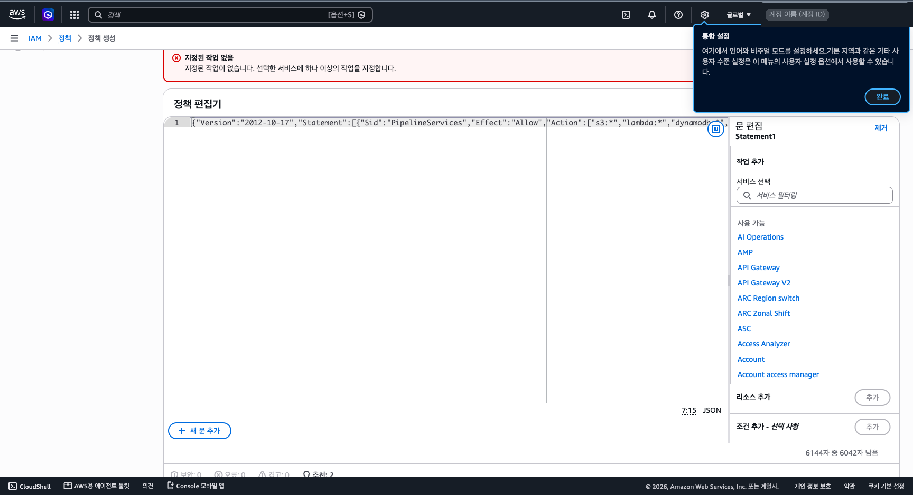

# 2부 — 배포 키 발급

소요: 15~20분 · 필요한 것: 정책 파일 3개(`../config/policies/` 폴더) · 1부에서 만든 관리자 사용자

## 1. 왜 이런 키인가

배포 작업자(사람이든 Claude 같은 에이전트든)는 이 계정에서 파일 보관소(S3)·자동 처리 프로그램(Lambda)·표(DynamoDB)·검색 엔진(OpenSearch)과 그 운영에 필요한 것(로그·알람·배포)만 만지면 됩니다.
그래서 **배포에 관리자 권한(AdministratorAccess) 키를 쓰지 않습니다.** 대신 아래 정책 세 개로 범위를 제한한 키 — **배포 키** — 를 씁니다.

- `SlsServerlessAllow` — 위 서비스와 그 운영에 필요한 것만 **허용**
- `SlsGuardDeny` — 허용 목록 밖의 모든 서비스(AI 모델 Bedrock·서버 EC2·DB 서버 RDS 등), 결제·계정 설정 변경, 사용자·키 추가, 서울 밖 리전, 이 계정의 데이터를 밖의 계정에 넘기는 설정을 **명시 거부**
- `SlsLambdaBoundary` — 배포 작업자가 만드는 자동 처리 프로그램(Lambda)에 씌우는 **권한 상한**. 프로그램을 거쳐 허용 목록 밖 서비스를 쓰는 길을 막습니다

관리자 키가 유출되면 몇 시간 만에 수백만 원이 나가는 사고가 실제로 있습니다. 이 키는 허용 목록 밖이 명시 거부되어 있고, 배포 작업자도 키를 검증 스크립트(`verify.sh`)로 확인한 뒤에만 씁니다.

**이 키는 이 용도로 새로 만든 전용 계정(1부)에만 발급해 주세요.** 이미 운영 중인 계정에 붙이면 허용 목록 안 서비스(S3·DynamoDB 등)의 기존 자원까지 손댈 수 있게 됩니다.

| 용어 | 뜻 |
|---|---|
| IAM | AWS 안에서 "누가 무엇을 할 수 있나"를 정하는 메뉴 |
| 정책(Policy) | 허용·거부 규칙을 적은 문서(JSON). `../config/policies/` 의 파일이 이것 |
| 사용자 그룹 | 정책을 묶어 두는 상자. 사용자를 넣으면 그 정책이 적용됨 |
| 사용자(User) | 배포 작업자용 이름표(`sls-deployer`). 콘솔 로그인 없이 명령줄(CLI)로만 씀 |
| 액세스 키 | 그 사용자의 ID·비밀번호에 해당하는 두 문자열. 배포 작업자 PC 의 프로파일에서만 씀 |
| Sid | 정책 JSON 안 규칙마다 붙은 이름표. 붙여넣기가 잘리지 않았는지 확인할 때 씀 |

## 2. 발급 절차 (콘솔, 15~20분)

1부 3.5 에서 만든 관리자 사용자(`admin-<영문이름>`)로 로그인해 진행합니다. 루트 사용자로는 하지 않습니다.
아래 화면은 2026년 9월 이 절차를 그대로 따라 한 실제 화면입니다(계정 식별값은 회색 칸으로 가렸습니다).

### 2.1 정책 만들기 (3번 반복)

먼저 확인해 주세요. 처음 발급하는 계정이면 `sls-` 로 시작하는 역할, 서울 리전 Lambda 함수, CloudFormation 스택이 없어야 합니다(전용 새 계정 전제). 있으면 발급 전에 무엇인지 먼저 확인하세요. 검증 스크립트는 이 중 키 권한을 넘어설 수 있는 것 — 권한 상한(`SlsLambdaBoundary`)이 없는 역할, 다른 역할로 도는 함수, 서비스 역할이 붙은 스택 — 이 있으면 키를 반려합니다. 이 키로 이미 배포한 뒤 키만 다시 발급하는 경우(2.5·2.6)는 그대로 두면 됩니다.

1. 콘솔 상단 검색에서 **IAM** → 왼쪽 **정책** → **정책 생성**.
2. **JSON** 탭 선택 → 편집기의 기본 내용을 전부 지우고 `SlsServerlessAllow.json` 내용을 붙여넣기 → 편집기 아래 **오류 0** 확인(보안 경고·"추천"은 무시해도 됩니다) → **다음**.
3. 정책 이름 **`SlsServerlessAllow`**(파일 이름과 똑같이, 대소문자까지) → **정책 생성** → 정책 목록으로 돌아가 생성 완료가 표시됩니다.
4. 같은 방법으로 `SlsGuardDeny.json` → 이름 **`SlsGuardDeny`**, `SlsLambdaBoundary.json` → 이름 **`SlsLambdaBoundary`**.
5. 확인: 정책 목록 검색창에 `Sls` 를 입력하면 세 개가 보여야 합니다. 붙여넣기가 잘리지 않았는지는 각 정책을 열어 JSON 맨 끝에 아래 이름표(Sid)가 있는지로 봅니다 — `SlsServerlessAllow` 는 `"Sid": "CostReadOnly"`, 나머지 둘은 `"Sid": "DenyOutsideSeoulRegion"`. 없으면 다시 붙여넣습니다.



### 2.2 그룹 만들기

1. 왼쪽 **사용자 그룹** → **그룹 생성** → 이름 **`sls-operators`**.
2. 아래 "권한 정책 연결"에서 `SlsServerlessAllow`, `SlsGuardDeny` **두 개만** 체크 → 체크된 정책이 이 둘뿐인지 한 번 더 보고 **그룹 생성**. (`SlsLambdaBoundary` 는 그룹에 붙이지 않습니다. 배포할 때 자동으로 쓰입니다.)

### 2.3 사용자 만들기

1. 왼쪽 **사용자** → **사용자 생성** → 이름 **`sls-deployer`**.
2. "AWS Management Console에 대한 사용자 액세스 권한 제공"은 **체크하지 않습니다**(명령줄 전용).
3. 권한 설정에서 **그룹에 사용자 추가** → `sls-operators` 체크 → **다음** → 검토 화면에서 사용자 이름 `sls-deployer` 와 그룹 `sls-operators` 확인 → **사용자 생성**. 사용자 목록에 `sls-deployer` 가 보이면 끝입니다. 정책을 사용자에 직접 붙이거나 인라인 정책을 추가하지 않습니다.

### 2.4 액세스 키 발급

1. 방금 만든 `sls-deployer` 클릭 → **보안 자격 증명** 탭 → **액세스 키 만들기**.
2. 사용 사례 **Command Line Interface(CLI)** 선택 → 아래 확인 체크 → **다음** → 설명 태그 `sls-2026` → **액세스 키 만들기**.
3. 화면의 **액세스 키**와 **비밀 액세스 키** 두 값을 복사하거나 「.csv 파일 다운로드」. 비밀 키는 이 화면에서만 보입니다 — 닫으면 다시 볼 수 없습니다. (화면을 공유·녹화하거나 에이전트에게 보여 주는 중이면 이 단계에서는 멈춰 주세요.)
4. **12자리 계정 ID** 도 적어 둡니다 — 1부 3.5 로그인 URL 의 숫자, 또는 콘솔 오른쪽 위 계정 메뉴. 검증 스크립트가 "맞는 계정의 키인가"를 이 값으로 확인합니다.

### 2.5 배포 작업자 환경에 프로파일 등록

- 배포 작업자 PC 의 터미널에서 직접 등록합니다: `aws configure --profile sls-deployer` → 두 값 입력, region `ap-northeast-2`, output `json`. 키는 `~/.aws/credentials` 에만 둡니다.
- 두 값을 **이메일 본문·카톡·슬랙 메시지·에이전트 대화창에 붙여넣지 않습니다.** 에이전트에게 배포를 맡길 때도 키 값이 아니라 프로파일 이름(`sls-deployer`)만 알려 줍니다.
- 배포 작업자가 다른 사람이면: 1Password/Bitwarden 공유 링크, 또는 통화로 비밀 키만 구두 전달, 또는 csv 를 암호 건 zip 으로 보내고 암호는 다른 채널로.
- 등록이 끝나면 내려받은 csv 는 삭제해 주세요.
- **키가 새어 나갔다고 의심되면**(메신저·대화창에 붙여넣음, 화면 공유에 노출 등) 곧바로 IAM → 사용자 `sls-deployer` → 보안 자격 증명 → 그 키 **비활성화** → 2.4 로 새 키를 발급해 프로파일을 다시 등록합니다(사용자당 키는 2개까지라 옛 키는 삭제).

### 2.6 verify.sh 로 확인

프로파일을 등록한 환경에서 검증 스크립트로 키를 확인합니다(5분, 볼트 루트에서). 판정표는 `../config/skills/aws-iam-access.md` § 절차 B.

```bash
aws sts get-caller-identity --profile sls-deployer
projects/aws-serverless/config/scripts/verify.sh sls-deployer <12자리 계정ID>; echo "exit=$?"
```

- **통과**(exit 0) — 배포를 시작합니다.
- **수정 요청**(exit 2) — 출력의 FAIL 줄 항목(예: 루트 MFA, S3 퍼블릭 차단)만 고치고 전체를 다시 돌립니다. 키는 그대로 씁니다.
- **반려**(exit 1) — 정책이 다르게 붙은 경우입니다. 그 키를 **삭제**하고, FAIL 줄이 가리키는 대로 정책·그룹을 바로잡은 뒤 2.4 로 새 키를 발급해 프로파일을 다시 등록합니다.

## 3. 이 키로 되는 것 / 안 되는 것

- 됩니다: 서울 리전에서 S3·Lambda·DynamoDB·OpenSearch Serverless·SQS·SNS·CloudWatch·CloudFormation 생성/삭제, 그 프로그램용 실행 역할(`sls-` 로 시작, 권한 상한 부착) 만들기, 비용 조회.
- 안 됩니다: 다른 리전, EC2·RDS·Bedrock 등 서버·AI 서비스, 사용자·키·정책 만들기, `sls-` 밖 역할 만들기·고치기, 실행 역할에 허용 목록 밖 권한 붙이기, 결제·계정 설정 변경, 다른 역할로 전환, KMS·API Gateway·EventBridge·VPC, 인증 없는 Lambda 공개 URL, 다른 계정·아무나(`*`)에게 Lambda 호출 권한 주기(S3·SNS 같은 AWS 서비스 주체는 허용), 실행 역할의 신뢰 대상 바꾸기, 경로 붙은 역할 만들기, 표(DynamoDB)·대기열·주제·로그를 다른 계정에 공유하기, S3 ACL·접근점·로깅·복제·인벤토리로 밖에 내보내기, DynamoDB 예약 용량 구매, 계정 수준 S3 퍼블릭 차단 해제(1부 3.7 에서 켠 것), 검색 엔진 용량 상한 변경과, 상한을 비켜 가는 별도 용량 묶음(컬렉션 그룹) 만들기·바꾸기(1부 3.6).
- 파일 보관소(버킷) 하나를 공개로 바꾸는 것은 이 키로도 가능합니다. 1부 3.7 의 **계정 수준 퍼블릭 액세스 차단**이 그것을 막는 장치이므로 반드시 켜 주세요. 특정 외부 계정에만 주는 버킷 정책은 이 키로도 가능하므로 아래 4 의 3번(남은 접근 경로 확인)에서 봅니다.
- 비용 조회가 되려면 1부 3.3 의 "결제 정보에 대한 IAM 사용자 및 역할 액세스"가 켜져 있고 Cost Explorer 를 한 번 연 상태여야 합니다.

## 4. 사용이 끝나면

30분 정도 걸립니다. 계정 관리자가 할 일은 셋입니다(배포 작업자 쪽 순서는 `../config/skills/aws-iam-access.md` § 사용 종료·정리).

1. **남길 것 정하기** — 만든 것(S3·Lambda·DynamoDB·OpenSearch)은 이 계정의 것입니다. 단 **검색 엔진(OpenSearch)은 켜 둔 시간만큼 고정 요금**(1부 § 4)이라, 계속 쓸지 미정이면 검색 엔진만 먼저 지우고 나머지는 남깁니다 — 검색 엔진은 나중에 저장된 데이터로 다시 만들 수 있습니다.
2. **키 끄기** — 배포 작업자가 마지막 청구를 확인한 다음 날, IAM → 사용자 `sls-deployer` → 보안 자격 증명 → 액세스 키 **비활성화** → 일주일 뒤 문제가 없으면 **삭제**. 정책 3개·그룹·사용자는 남겨 두어도 무해합니다(특히 `SlsLambdaBoundary` 는 남긴 프로그램을 다시 배포할 때 필요합니다).
3. **남은 접근 경로 확인** — 키를 지워도 외부에서 들어올 길이 남지 않았는지 관리자 사용자 화면에서 확인합니다(역할의 신뢰 관계, 파일 보관소·프로그램·검색 엔진의 접근 정책). 확인 결과와 다시 켜는 방법은 정리 기록 한 장으로 남깁니다.
