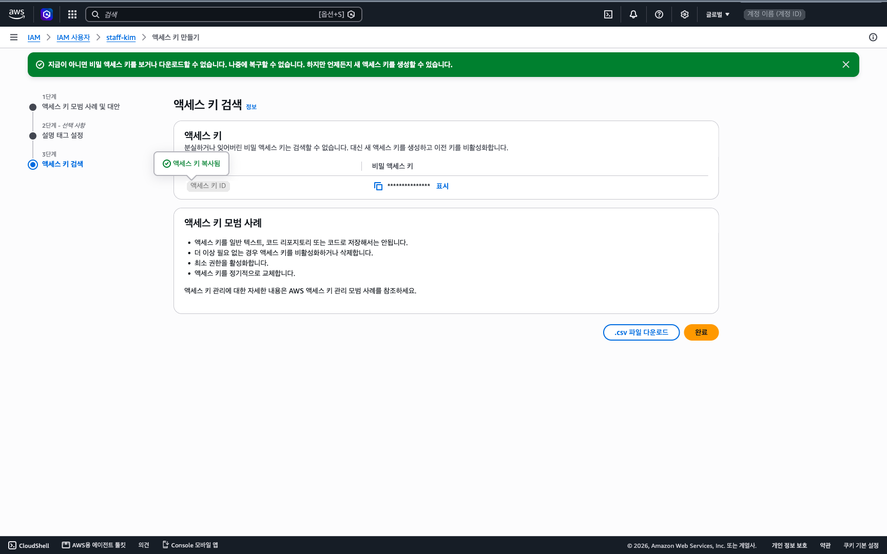
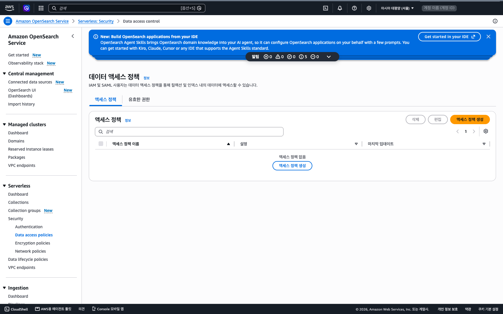
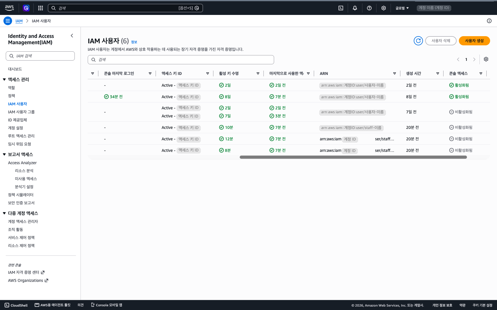
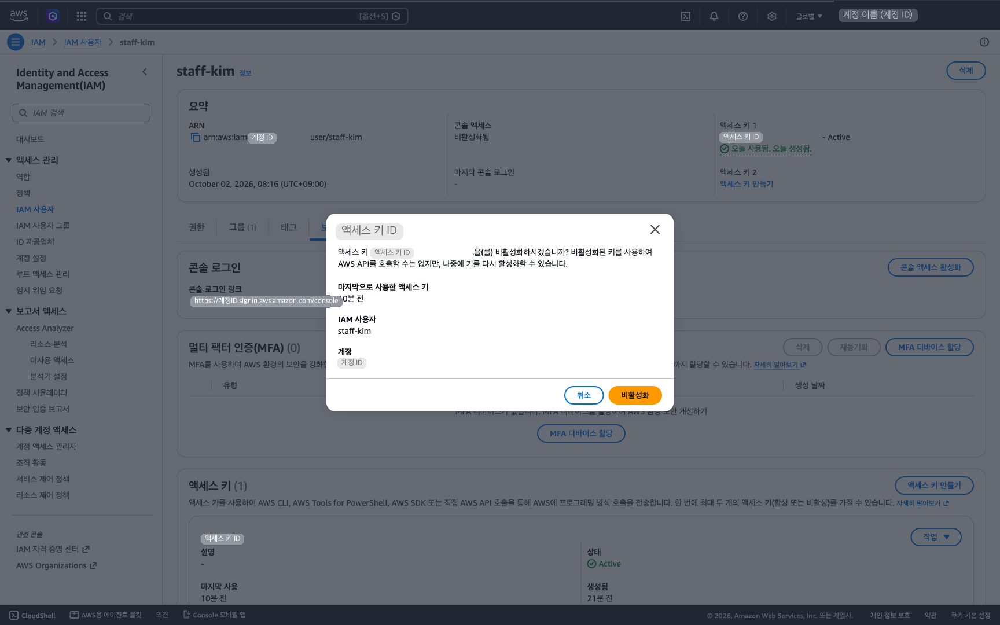

# 3부 — 실무자 권한 (적재·조회·수정)

소요: 정책·그룹·사용자·키 약 25분(실무자 3명 기준) + 검색 읽기 정책 약 5분 · 필요한 것: 실무자용 정책 파일 3개(`../config/policies/` 폴더의 `SlsStaff…` 파일) · 2부에서 만든 `SlsGuardDeny` · 1부에서 만든 관리자 사용자

언제 하나: 배포 작업자가 파일 보관소·표·검색 엔진을 만들어 둔 뒤, 조직의 실무자가 직접 쓰기 시작할 때입니다. 사용 기간 중에도, 끝난 뒤에도 할 수 있습니다.

## 1. 누구에게 무엇을 주나

1부·2부를 마친 계정에는 사용자가 두 종류뿐입니다 — 모든 것을 할 수 있는 관리자(`admin-…`)와, 만들고 고치는 일을 맡은 배포 키 사용자(`sls-deployer`). 실무자가 데이터를 쓰기 시작할 때 관리자 권한을 나눠 주면 누구나 무엇이든 지울 수 있게 됩니다.
그래서 실무자에게는 **하는 일에 맞는 권한 유형 하나**를 줍니다. 유형은 세 가지입니다.

| 유형 | 이런 사람 | 되는 것 | 안 되는 것 |
|---|---|---|---|
| **적재** | 파일을 올리는 사람 | 파일 보관소에 파일 올리기, 올라간 파일 이름 보기 | 파일 내려받기·지우기, 표와 검색 엔진 |
| **조회** | 데이터를 읽는 사람(보고서·대시보드를 만드는 사람 포함) | 파일 내려받기, 표 읽기, 검색하기 | 올리기·고치기·지우기 전부 |
| **수정** | 표의 내용을 고치는 사람 | 조회 유형이 되는 것 전부 + 표의 항목 추가·수정·삭제 | 파일 올리기·지우기, 표 자체를 만들거나 지우기 |

저장하는 곳별로 보면 이렇습니다.

| | 파일 보관소(S3) | 표(DynamoDB) | 검색 엔진(OpenSearch) |
|---|---|---|---|
| 적재 | 쓰기(올리기만) | — | — |
| 조회 | 읽기 | 읽기 | 읽기 |
| 수정 | 읽기 | 읽기 + 쓰기 | 읽기 |

검색 엔진에는 어느 유형도 직접 쓰지 않습니다. 표가 바뀌면 검색 엔진에 자동으로 반영됩니다.

세 유형 모두 **액세스 키로만** 씁니다. 실무자는 AWS 콘솔에 로그인하지 않습니다.
세 유형 모두 안 되는 것: 서울 밖 리전, 허용 목록 밖 서비스(서버 EC2·AI 모델 Bedrock 등), 사용자·키·정책 만들기. 실무자는 자기 키를 새로 만들거나 지우지 못하므로 키 재발급은 계정 관리자가 합니다(7절).

| 용어 | 뜻 |
|---|---|
| ARN | AWS 안에서 사용자·자원 하나를 가리키는 긴 이름. `arn:aws:iam::…:user/staff-…` 꼴 |
| 데이터 접근 정책 | 검색 엔진 안에서 "누가 문서를 읽고 쓸 수 있나"를 정하는 명단. IAM 정책과 별개로 검색 엔진 메뉴에 있음 |
| 컬렉션 | 검색 엔진 하나를 부르는 이름 |
| 실무자 | 계정 관리자도 배포 작업자도 아니고, 만들어진 데이터 창구를 키로 쓰는 사람(조직의 데이터를 올리고 보는 사람). AWS 화면의 이름에는 영어 `staff` 가 들어갑니다 — 사용자 `staff-<영문이름>`, 그룹 `sls-staff-…`, 정책 `SlsStaff…` |

그 밖의 용어(IAM·정책·사용자 그룹·액세스 키·Sid)는 2부 1절의 표와 같습니다.

## 2. 시작 전에 — 모아 둘 값

아래 다섯 값은 배포한 스택의 Outputs 에 있고, 배포 작업자가 남긴 정리 기록에도 적혀 있습니다. 실무자에게 권한을 줄 때와 실무자가 명령을 칠 때 씁니다.

- 파일 보관소 이름(버킷 이름)
- 표 이름
- 검색 엔진 이름(컬렉션 이름) — OpenSearch Service 콘솔의 Serverless 컬렉션 목록에서도 보입니다
- 검색 주소(`https://….ap-northeast-2.aoss.amazonaws.com` 꼴)
- 인덱스 이름(검색 엔진 안에서 문서가 담긴 곳의 이름)

## 3. 발급 절차 (콘솔)

1부 3.5 에서 만든 관리자 사용자(`admin-<영문이름>`)로 로그인해 진행합니다. 콘솔 오른쪽 위 리전이 **서울**인지 먼저 확인합니다.

### 3.1 정책 만들기 (3번 반복)

화면과 순서는 2부 2.1 과 같습니다. 파일만 다릅니다.

1. 콘솔 상단 검색에서 **IAM** → 왼쪽 **정책** → **정책 생성**.
2. 편집기 위 **시각적 | JSON** 에서 **JSON** 선택 → 편집기의 기본 내용을 전부 지우고 `SlsStaffPush.json` 내용을 붙여넣기 → 편집기 아래 줄이 **보안: 0 · 오류: 0 · 경고: 0 · 추천: 0** 인지 확인 → **다음**.
3. 정책 이름 **`SlsStaffPush`**(파일 이름과 똑같이, 대소문자까지) → **정책 생성**.
4. 같은 방법으로 `SlsStaffQuery.json` → 이름 **`SlsStaffQuery`**, `SlsStaffEdit.json` → 이름 **`SlsStaffEdit`**. `SlsStaffQuery` 의 검토 화면("이 정책에 정의된 권한")에는 OpenSearch Serverless 줄에 "쓰기" 가 보입니다. 검색 엔진 접속 권한(`aoss:APIAccessAll`)이 그렇게 분류될 뿐이고, 실제 문서 쓰기는 3.4 의 읽기 정책이 막습니다.
5. 확인: 정책 목록 검색창에 `SlsStaff` 를 입력하면 세 개가 보여야 합니다. 붙여넣기가 잘리지 않았는지는 각 정책을 열어 JSON 맨 끝의 이름표(Sid)로 봅니다 — `SlsStaffPush` 는 `"Sid": "UploadToDataBucket"`, `SlsStaffQuery` 는 `"Sid": "FindSearchCollection"`, `SlsStaffEdit` 는 `"Sid": "WriteDocTable"`. 없으면 다시 붙여넣습니다.

### 3.2 그룹 만들기 (3개)

유형마다 그룹 하나입니다. 왼쪽 **IAM 사용자 그룹**(2부의 **사용자 그룹** 과 같은 메뉴) → **그룹 생성**에서 아래 표대로 세 번 만듭니다. 정책 칸에 `Sls` 로 검색하면 체크할 정책이 모두 보입니다.

| 그룹 이름 | 체크할 정책 |
|---|---|
| `sls-staff-push` | `SlsStaffPush` + `SlsGuardDeny` |
| `sls-staff-query` | `SlsStaffQuery` + `SlsGuardDeny` |
| `sls-staff-edit` | `SlsStaffQuery` + `SlsStaffEdit` + `SlsGuardDeny` |

- `SlsGuardDeny` 는 2부에서 만든 것을 그대로 씁니다. 새로 만들지 않습니다.
- 수정 그룹에는 조회 정책이 **같이** 들어갑니다. `SlsStaffEdit` 에는 쓰기 권한만 있어, 조회 정책이 빠지면 읽지 못합니다.
- 확인: 그룹 목록에 `sls-staff-push`·`sls-staff-query`·`sls-staff-edit` 세 개가 보이고, 그룹을 열어 **권한** 탭의 정책 수가 표와 같은지 봅니다(2개·2개·3개).

### 3.3 사용자 만들기와 키 발급

실무자 한 명마다 사용자 하나입니다. 화면은 2부 2.3·2.4 와 같습니다.

1. 왼쪽 **IAM 사용자**(2부의 **사용자**) → **사용자 생성** → 이름 **`staff-<영문이름>`**(예: `staff-hong`. 한글은 쓸 수 없습니다).
2. "AWS Management Console에 대한 사용자 액세스 권한 제공"은 **체크하지 않습니다**. 실무자는 콘솔에 들어오지 않습니다.
3. 권한 설정에서 **그룹에 사용자 추가** → 그 실무자의 유형 그룹 하나를 체크 → **다음** → **사용자 생성**. 정책을 사용자에 직접 붙이지 않습니다.
4. 만든 사용자 클릭 → **보안 자격 증명** 탭 → **액세스 키 만들기** → 사용 사례 **Command Line Interface(CLI)** → 확인 체크 → **다음** → **액세스 키 만들기**.
5. 화면의 **액세스 키**와 **비밀 액세스 키** 두 값을 복사하거나 「.csv 파일 다운로드」. 이 화면을 닫으면 비밀 키는 다시 볼 수 없습니다. **완료** 를 눌러도 화면이 그대로면 브라우저의 뒤로 가기로 나와도 됩니다(키는 이미 만들어졌습니다).
6. 조회·수정 실무자면 요약의 **ARN**(`arn:aws:iam::…:user/staff-…` 한 줄)을 복사해 둡니다. 3.4 에서 씁니다(1부 3.5 의 6번과 같은 자리입니다). 같은 요약에서 **콘솔 액세스** 가 "비활성화됨" 인지도 봅니다.

한 사람이 두 가지 일을 하면(예: 올리기도 하고 읽기도 함) 사용자를 둘 만들지 않고 **그룹 두 개에** 넣습니다.



### 3.4 검색 읽기 정책 만들기 (조회·수정 실무자가 있을 때)

검색 엔진은 IAM 정책만으로는 열리지 않습니다. 검색 엔진 쪽 명단(데이터 접근 정책)에 그 실무자가 있어야 읽을 수 있습니다. 실무자용 명단을 **읽기 전용으로 하나** 만듭니다. 적재 실무자는 넣지 않습니다.

1. 콘솔 상단 검색에서 **OpenSearch Service** → 왼쪽 메뉴 **Serverless → Security → Data access policies**(이 메뉴는 한국어 설정에서도 영어로 나옵니다). 리전이 서울인지 다시 봅니다.
2. **액세스 정책 생성** → 이름 **`<컬렉션 이름>-read`**(예: 컬렉션이 `sls-test-docs` 면 `sls-test-docs-read`).
3. **정책 정의 방법** 은 **Visual editor** 그대로 두고 **규칙 1** 을 채웁니다. 넣을 것은 셋뿐입니다 — 대상(조회·수정 실무자), 컬렉션 권한 하나, 인덱스 권한 둘.
   - **보안 주체 추가 ▼ → IAM 사용자 및 역할** → 검색 칸에 실무자 이름(`staff-…`)을 입력해 `Users = arn:aws:iam::…:user/staff-…` 를 고르고 **저장**. 실무자가 여럿이면 반복합니다.
   - **권한 부여** → "별칭 및 템플릿 권한" 에서 **설명** 만 체크 → 그 아래 칸에 컬렉션 이름을 입력하고 Enter → "인덱스 권한" 에서 **설명** 과 **문서 읽기** 만 체크 → "인덱스 선택" 의 컬렉션 칸에 같은 컬렉션 이름, 인덱스 칸에 `*` 를 입력하고 각각 Enter → 맨 아래 **Agent permissions** 는 비워 두고 **저장**.
4. **생성**.
5. 확인: 만든 정책을 열면 **선택된 보안 주체** 에 `staff-` 사용자만, **부여된 리소스 및 권한** 에 셋만 있어야 합니다 — `collection/<컬렉션 이름>` 의 `aoss:DescribeCollectionItems`, `index/<컬렉션 이름>/*` 의 `aoss:DescribeIndex`·`aoss:ReadDocument`. 같은 내용을 JSON 으로 쓰면 아래와 같습니다(대조용. 규칙 순서와 `Description` 줄은 달라도 됩니다). 실무자가 여러 명이면 `Principal` 에 ARN 이 그 수만큼 있습니다.

```json
[
  {
    "Rules": [
      {
        "ResourceType": "index",
        "Resource": ["index/<컬렉션 이름>/*"],
        "Permission": ["aoss:ReadDocument", "aoss:DescribeIndex"]
      },
      {
        "ResourceType": "collection",
        "Resource": ["collection/<컬렉션 이름>"],
        "Permission": ["aoss:DescribeCollectionItems"]
      }
    ],
    "Principal": [
      "arn:aws:iam::<계정 ID>:user/staff-<영문이름>"
    ]
  }
]
```

> **이름이 `-data` 로 끝나는 정책은 고치지 않습니다.** 그것은 파이프라인이 쓰는 명단입니다. 거기에 실무자를 넣으면 그 실무자가 검색 엔진의 모든 권한을 갖게 되고, 안의 항목을 지우면 검색 반영이 멈춥니다. 실무자는 `-read` 에만 넣습니다.

반영에는 보통 1분 안팎, 늦으면 몇 분 걸립니다.



## 4. 실무자에게 전달할 것

- **키 두 값** — 2부 2.5 와 같은 방법(비밀번호 관리자 공유 링크, 구두, 암호 건 zip + 다른 채널로 암호)으로 넘깁니다. 이메일 본문·메신저 메시지에 붙여넣지 않습니다. 전달 후 관리자 PC 의 csv 는 삭제합니다.
- **2절의 값 가운데 그 유형이 쓰는 것** — 적재는 버킷 이름, 조회·수정은 다섯 값 전부.
- **설정 방법** — 실무자 PC 에 AWS CLI 를 설치하고 `aws configure` 를 실행해 키 두 값을 넣습니다. 리전(Default region name)은 반드시 **`ap-northeast-2`** 입니다. 다른 리전으로 두면 모든 명령이 거부됩니다.

유형별 예시 명령입니다(macOS·Linux 터미널 기준).

적재 — 올리기:

```
aws s3 cp report.json s3://<버킷 이름>/report.json
```

조회 — 내려받기, 표 읽기, 검색하기:

```
aws s3 cp s3://<버킷 이름>/report.json .
aws dynamodb query --table-name <표 이름> --key-condition-expression "docId = :d" --expression-attribute-values '{":d":{"S":"report.json"}}'
awscurl --service aoss --region ap-northeast-2 -X POST -H 'Content-Type: application/json' -d '{"query":{"match_all":{}}}' <검색 주소>/<인덱스 이름>/_search
```

수정 — 표의 항목 고치기(`<버전 값>` 은 위 표 읽기 결과의 `version` 값):

```
aws dynamodb update-item --table-name <표 이름> --key '{"docId":{"S":"report.json"},"version":{"S":"<버전 값>"}}' --update-expression "SET memo = :m" --expression-attribute-values '{":m":{"S":"checked"}}'
```

- 검색은 AWS CLI 에 명령이 없어 `awscurl` 이라는 도구로 보냅니다(`pip install awscurl`). `--region ap-northeast-2` 를 빼면 다른 리전으로 서명되어 이유 없이 `403 Forbidden` 으로 거부됩니다.
- 보고서·대시보드를 만드는 사람은 **조회 유형의 키**로 데이터를 읽어 쓰던 도구에서 만듭니다. 도구에 넣을 값은 넷입니다 — 검색 주소, 리전 `ap-northeast-2`, 서명 서비스 이름 `aoss`, 인덱스 이름. 도구의 AWS 서명(SigV4) 설정에 넣습니다.

## 5. 실무자 더하기·빼기·유형 바꾸기

- **더하기** — 3.3 으로 사용자를 만들어 그룹에 넣습니다. 조회·수정 유형이면 3.4 의 읽기 정책을 열어 **편집** → **보안 주체 추가 ▼ → IAM 사용자 및 역할** 로 그 실무자를 더하고 **저장** 합니다.
- **빼기** — 읽기 정책을 열어 **편집** → 그 실무자 ARN 옆의 **×** → **저장**. 그룹에서도 뺍니다.
- **마지막 한 명을 뺄 때** — 읽기 정책 자체를 삭제합니다(정책을 열어 **삭제** → 확인 칸에 `확인`). 대상을 비운 채로는 `Principal: there must be a minimum of 1 items` 오류로 저장되지 않습니다.
- **유형 바꾸기** — 그룹만 옮깁니다. 조회에서 수정으로 바꿀 때 읽기 정책은 그대로 둡니다. 적재에서 조회·수정으로 바꾸면 읽기 정책에 더하고, 반대면 뺍니다.

읽기 정책을 고친 뒤 실제로 되거나 막히기까지 보통 1분 안팎, 늦으면 몇 분 걸립니다.

## 6. 지금 누가 어떤 권한인지 보기

분기에 한 번은 아래 세 곳을 봅니다. 나간 사람이 남아 있지 않은지, 유형이 지금 하는 일과 맞는지 확인합니다.

1. **유형별 명단** — IAM → **IAM 사용자 그룹** → 그룹 셋(`sls-staff-push`·`-query`·`-edit`)을 각각 열어 **사용자** 탭.
2. **검색 읽기 명단** — OpenSearch Service → Serverless → Security → **Data access policies** → `<컬렉션 이름>-read` 의 **선택된 보안 주체**. 1번의 조회·수정 명단과 같아야 합니다.
3. **안 쓰는 키** — IAM → **IAM 사용자** 목록의 **마지막으로 사용한 액세스 키** 열(표를 오른쪽으로 넘기면 보입니다). 최근 사용은 보통 몇 시간 안에 반영되어 방금 쓴 키가 "없음" 으로 보일 수 있습니다. 오래 안 쓴 키는 7절대로 비활성화합니다.



## 7. 사람이 나갈 때, 키를 잃어버렸을 때

**사람이 나갈 때** — 순서대로 합니다.

1. IAM → IAM 사용자 `staff-…` → 보안 자격 증명 → 액세스 키의 **작업 ▼ → 비활성화** → 확인 창의 **비활성화**. 그 자리에서 막힙니다.
2. 조회·수정 실무자였으면 읽기 정책의 대상에서 뺍니다(5절). 읽기 정책은 사용자가 실제로 있는지 보지 않아 없는 사용자의 ARN 도 그대로 저장되므로, 사용자를 지우기 전에 따로 뺍니다.
3. 사용자 **삭제** → 확인 칸에 `confirm` 입력 → **사용자 삭제**.

**키가 새었거나 잃어버렸을 때** — 같은 화면에서 그 키를 **비활성화**하고 3.3 의 4~5번으로 새 키를 발급해 다시 전달합니다. 실무자는 자기 키를 새로 만들지 못합니다. 사용자당 키는 2개까지라 옛 키는 삭제합니다.



## 8. 하면 안 되는 조합

- 수정 그룹에서 `SlsStaffQuery` 를 빼지 않습니다. 읽기가 안 됩니다.
- 실무자 그룹에서 `SlsGuardDeny` 를 빼지 않습니다. 다른 리전·다른 서비스·키 만들기를 막는 장치입니다.
- 실무자를 `sls-operators`(배포 키 그룹)에 넣지 않습니다. 만들고 지우는 권한 전부가 갑니다.
- 정책을 사용자에 직접 붙이지 않습니다. 그룹으로만 줍니다.
- 실무자용 사용자에 콘솔 액세스를 켜지 않습니다.
- 실무자 정책의 내용을 고쳐 쓰려면 배포 작업자에게 먼저 알립니다(같은 사람이 아니면). 배포 키 검증(`verify.sh` V8b)이 원본(`../config/policies/`)과 다른 실무자 정책을 수정 요청으로 잡습니다.

## 9. 유형별 주의

- **적재** — 같은 이름으로 다시 올리면 덮어쓰지 않고 새 버전이 됩니다. 옛 버전은 남고, 검색에는 두 버전이 모두 나옵니다. 올린 파일은 적재 실무자가 지우지 못합니다. 보관소 안 파일 이름은 볼 수 있습니다.
- **조회** — 표 전체 읽기(`scan`)는 읽은 만큼 요금이 나옵니다. 찾는 파일 이름을 알면 위 예시처럼 `query` 로 그 항목만 읽습니다. 내려받은 파일과, 키로 만든 임시 공유 주소(최대 7일 유효)는 받은 사람 누구나 열 수 있으니 밖으로 내보내지 않습니다.
- **수정** — 고친 내용은 검색에 자동 반영됩니다. 같은 파일을 다시 올리면 새 버전 항목이 원래 내용으로 생기고, 고친 내용은 옛 버전 항목에만 남습니다. 여러 항목을 한 번에 지우는 명령도 쓸 수 있어 **표 전체를 지울 수도 있습니다.** 표에는 시점 복구(되돌리기) 기능이 꺼져 있어, 지운 항목은 실무자가 되살리지 못합니다. 같은 파일을 다시 올리면 원래 내용이 새 버전 항목으로 들어올 뿐이고, 지운 그 항목을 되살리는 일은 계정 관리자나 배포 작업자가 합니다. 수정 유형은 꼭 필요한 사람에게만 줍니다. 기존 값과 다른 종류의 값(숫자 자리에 글자)을 넣으면 검색 반영이 실패하고 알람 메일이 옵니다.

## 10. 안 될 때

| 증상 | 원인 | 조치 |
|---|---|---|
| 검색이 거부됨: `403` 과 `"reason":"Bad Authorization"` | 읽기 정책의 대상에 없거나, 넣은 직후라 아직 반영 전(보통 1분 안팎, 늦으면 몇 분) | 3.4·5절 확인, 몇 분 뒤 다시 |
| 검색이 거부됨: `"reason":"403 Forbidden"` 만 나옴 | 검색 명령에 `--region ap-northeast-2` 가 빠졌거나, 검색을 쓰지 않는 유형(적재)의 키 | 4절 예시 명령 그대로인지, 그 실무자의 그룹 확인 |
| 명령이 거부됨: `AccessDenied … because no identity-based policy allows the … action` | 그 유형에 없는 작업이거나, 그룹 조합이 3.2 표와 다름 | 그룹의 정책 수 확인 |
| 명령이 거부됨: `… with an explicit deny in an identity-based policy: …/SlsGuardDeny` | 실무자 PC 의 리전이 `ap-northeast-2` 가 아니거나, 허용 목록 밖 서비스 | `aws configure` 의 리전 확인 |
| 적재 실무자의 내려받기: `An error occurred (403) when calling the HeadObject operation: Forbidden` | 적재 유형에는 내려받기 권한이 없음 | 정상. 읽어야 하면 조회 그룹에도 넣는다 |
| 수정 실무자가 읽기부터 안 됨: `AccessDeniedException … dynamodb:Query …` | 수정 그룹에 `SlsStaffQuery` 가 빠짐 | 3.2 표대로 다시 붙임 |
| 모든 명령이 `The security token included in the request is invalid` | 키가 비활성화되었거나 삭제됨 | 7절, 계정 관리자가 새 키 발급 |
| 검색 엔진을 지웠다 다시 만든 뒤 연결이 안 됨 | 검색 주소가 바뀜 | 새 검색 주소를 실무자에게 다시 전달. 새 주소도 만든 직후 1분쯤은 `DNS resolution failure` 가 날 수 있어 잠시 뒤 다시 칩니다. 컬렉션 이름이 같으면 읽기 정책은 고치지 않아도 이어집니다(실측 한 번). 그래도 거부되면 3.4 의 상세 화면으로 대상을 확인합니다 |
| 검색 엔진 이름을 바꿔 다시 만든 뒤 전원 검색 거부 | 읽기 정책이 옛 이름을 가리킴 | 새 이름으로 3.4 를 다시 |
