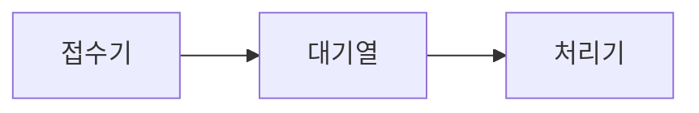

# 처리 흐름

요청 하나가 지나는 길을 단계로 적는다.

## 받기

접수기가 요청을 받아 형식을 본다. 형식 검사를 통과하지 못한 요청은 여기서 끝난다.

## 줄 세우기

검사를 통과한 요청이 대기열에 들어간다.

## 처리

처리기가 대기열에서 하나씩 순서대로 꺼내 처리한다.

## 알리기

알림기가 결과를 요청자에게 보낸다.

## 그림

```mermaid
graph LR
  접수기 --> 대기열 --> 처리기
```
